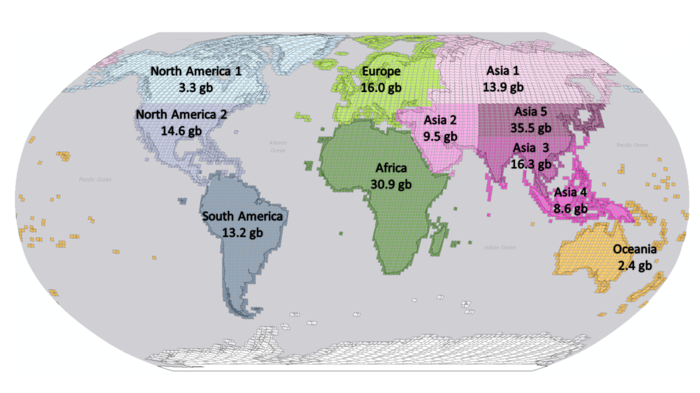

# Active Fire Detection in Landsat-8 Imagery: a Large-Scale Dataset and a Deep-Learning Study


## Authors

[Gabriel Henrique de Almeida Pereira](https://github.com/pereira-gha)

[Andre Minoro Fusioka](https://github.com/Minoro)

[Bogdan Tomoyuki Nassu](https://github.com/btnassu)

[Rodrigo Minetto](https://github.com/rminetto)


# Datasets and Weights

The datasets and trained weights are on [Google Drive](https://drive.google.com/drive/folders/1GIcAev09Ye4hXsSu0Cjo5a6BfL3DpSBm). The [weights](https://drive.google.com/drive/folders/1btWS6o-ZbwYqnnA2p31DIMV_lJ4qHYH2) folder contains the weights for the trained convolutional neural networks (CNNs), and the [dataset](https://drive.google.com/drive/folders/1FtW6TTl2BrNbYwhGUrSLZtrcv4zOX9tT) folder contains the image and fire mask patches. The dataset folder includes a [manually annotated dataset](https://drive.google.com/drive/folders/1M4GDDQuHYbbyjdIk9bqOxpUXHz-2nXtc) and a folder named [continents](https://drive.google.com/drive/folders/1IZ-Qebb-df2DFxfuSc2fXMRgd7493PDi) that holds the image patches and active fire masks generated by different algorithms. The data in the continents folder is divided in regions that correspond roughly to continents or subcontinents (see the picture below), this may be helpful if you wish to download only part of the dataset, and to avoid having a single huge compressed file.



We also provide a small subset of our dataset, randomly selected, with some patches and masks for those who want to try the code, but don't wish to download the full dataset. These samples are also on [Google Drive](https://drive.google.com/drive/folders/1HD34RJMlRN-XZgNYTu3PBOJ2FYyQoOe4), but in a different shared folder.

**Atention:** the "dataset" folder in this repository does not contain the original Landsat-8 images used to generate the dataset, only the already processed patches. If you want to run the scripts that generated the fire masks, either to recreate them or on a different set of Landsat-8 images, you will have to download the images and place them in specific directories within that folder. We provide the scripts for reference, but the actual dataset is comprised of the already processed 256x256-pixel patches and their corresponding fire masks.

The following sections describe how to use the files hosted on [Google Drive](https://drive.google.com/drive/folders/1GIcAev09Ye4hXsSu0Cjo5a6BfL3DpSBm) with this repository.

## Downloading the Full Dataset

Our dataset is divided in 11 regions, with each region having a zip file that contains the processed patches and the masks generated by [Kumar and Roy (2018)](https://doi.org/10.1080/17538947.2017.1391341), [Murphy et al. (2016)](https://doi.org/10.1016/j.rse.2016.02.027), and [Schroeder  et  al.  (2016)](https://doi.org/10.1016/j.rse.2015.08.032) conditions. We also include masks generated by combinations of these methods, using their intersection and a voting scheme (at least two methods must agree where fires occur).

You can download the patches directly from [Google Drive](https://drive.google.com/drive/folders/1FtW6TTl2BrNbYwhGUrSLZtrcv4zOX9tT), or if you want, you can use the `src/utils/download_dataset.py` script. If you want only a specific region (or only some regions) you can change the `REGIONS` constant in the script. This script will download the zipped files to `<your-local-repository>/dataset/compressed/`, if you want to use another direcotry, change the `OUTPUT_DIR` constant to point to the directory where the files should be saved. Before running the script you will need the [gdown](https://github.com/wkentaro/gdown) library, you can follow the install instructions on the library page. After you set the constants to the desired values and installed the `gdown` library you can run the script using: 

```
python download_dataset.py
```
**Atention:** Due to the dataset size you may face an error message with the text: "Too many users have viewed or downloaded this file recently", unfortunatly it's seems to be an [error without any fix](https://github.com/wkentaro/gdown/issues/26). If you find this error you wait and try again later, or download the files manually.

After you downloaded the desired regions you can uncompress the files running:

```
python unzip_patches.py
```

This script will unzip the downloaded files and separete the masks from the image patches. The image patches will be unzipped to `<your-local-repository>/dataset/images/patches` folder, while the masks will be placed in different folders inside `<your-local-repository>/dataset/images/masks`. The masks generated by the mentioned algorithms will be unzipped to `<your-local-repository>/dataset/images/masks/patches`, while the masks produced by their intersection will be unzipped to `<your-local-repository>/dataset/images/masks/intersection`, and the masks generated by the voting approach will be placed in `<your-local-repository>/dataset/images/masks/voting/`. This structure is used to train and evaluate the CNN models, if you change this structure be sure your training and evaluation scripts are pointing to the right directories.

We provide only the processed patches, with their respective masks, but if you want to download the original images used to generate the patches, and process them by yourself, the code inside the folder `src/landsat` gives you an easy way to get the Landsat-8 satellite data available on AWS.

## Downloading the small subset of our dataset

If you can't (or don't want to) download the full dataset, you can download a small subset of our dataset to try the code from this repository. Keep in mind that these samples represent only a small part of our dataset and were randomly selected, because of that you may find differents results from those described in our work.

You can download these samples directly from [Google Drive](https://drive.google.com/drive/folders/1HD34RJMlRN-XZgNYTu3PBOJ2FYyQoOe4) or use the `src/utils/download_dataset.py` script, before running the script you need to set the `DOWNLOAD_FULL_DATASET` to `False`, and then run:
```
python download_dataset.py
```

This will download the compressed samples to `<your-local-repository>/dataset` folder. Notice that the output folder is different from the one used to download the full dataset, this is done to avoid any errors when decompressing the samples if you also download the full dataset. If you want to download these samples to another folder you can set the `OUTPUT_SAMPLES` constant before running the script.

Once you have downloaded the samples, you can uncompress them using the `src/utils/unzip_patches` script. You just need to set the constant `FULL_DATASET` to `False` and run it with: 

```
python unzip_patches.py
```

## Downloading the Manually Annotated dataset

We also provide a manually annotated dataset, containing the patches extracted from the original Landsat-8 images (`landsat_patches.zip`), the masks generated by the algorithms from the literature and their combinations (`masks_patches.zip`), and the manually anotated masks for each patch (`manual_annotations_patches.zip`). The files are on [Google Drive](https://drive.google.com/drive/folders/1Gv96zhQ0HwIyquDL8vroarHoz_SJXtv5). You can use the `src/utils/download_manual_annotations.py` script to download these files, this script uses [gdown](https://github.com/wkentaro/gdown), you need install it before running this script. The files will be downloaded to `<your-local-repository>/dataset/manual_annotations/compressed` folder, if you want to save the files in a different directory you can change the `OUTPUT_DIR` constant. To use the download script, navigate to `src/utils` folder and run:

```
python download_manual_annotations.py
```

After downloading the zip files with the patches, you can unzip them with the `src/utils/unzip_manual_annotations.py` script. If you change the download directory make sure you set the `INPUT_DIR` constant to the same folder. You can also define where the files will be unzipped with the `OUTPUT_DIR` constant, the default value is `dataset/manual_annotatios`. This script will create a folder named `patches` that will contain another three folders, one for the images (`images`), one for the manual annotation patches (`annotations`) and another for the masks generated by the algorithms (`masks`). To unzip the files, go to the `src/utils/` directory and run:

```
python unzip_manual_annotations.py.py
```
## Models

Each folder inside the `src/train` directory contains the CNNs trained with different active fire detection algorithms. The codes inside these folders are almost the same, the only differences are in the constants that configure the CNNs (number of filters, number of channels, target masks, etc).

The masks used to train each model are obtained by the most well-known active fire detection algorithms and combinations of them. The models inside the `kumar-roy` folder were trained with masks generated by the [Kumar and Roy (2018)](https://doi.org/10.1080/17538947.2017.1391341) conditions. The models in the `murphy` folder used the [Murphy et al. (2016)](https://doi.org/10.1016/j.rse.2016.02.027) conditions. The models in the `schroeder` folder used the [Schroeder et al. (2016)](https://doi.org/10.1016/j.rse.2015.08.032) conditions. The models in the `intersection` and `voting` folders used masks obtained by combining the conditios, the former used an intersection (the three masks must agree on where fire occurs), while the latter used a voting scheme (at least two mask must agree on where fire ocurrs).

The `unet_16f_2conv_762` folder (aka. U-Net-Light (3c)) means that the model used is a `U-net` starting with 16 convolutional filters, with 2 convolutions per block, using channels 7, 6 and 2 from the source image. The folder named `unet_64f_2conv_762` (aka. U-Net (3c)) starts with 64 convolutional filters and uses channels 7, 6 and 2 from the source image. The folder named `unet_64f_2conv_10c` (aka. U-Net (10c) ) is pretty much the same, but starting with 64 convolutional filters in the first convolutional block and using all 10 channels from the source image.


## Downloading the pre-trained weights

Besides the datasets and code, you can download the weights for the trained models. They are available on [Google Drive](https://drive.google.com/drive/folders/1btWS6o-ZbwYqnnA2p31DIMV_lJ4qHYH2). The weights are grouped by the used masks, inside each zip you will find the weights for each model.

This repository includes the `src/utils/download_weights.py` script that will download the weights to `<your-local-repository>/weights`. If you want to change the directory where the weights are downloaded, change the `OUTPUT_DIR` constant. Besides, if you don't want to download all the weights you can remove the undesired ones from the `WEIGHT_FILES` constant.

This script needs the [gdown](https://github.com/wkentaro/gdown) library, if you don't have it yet, follow the library's [install instructions](https://github.com/wkentaro/gdown#installation). After you install it, you can navigate to `src/utils/` and run:

```
python download_weights.py
```

After downloading the weights, you need to move them to the right directories, for this purpouse you can use the `src/utils/unzip_download_weights.py` script. If you change the download directory, you must set the `ZIPED_WEIGHTS_DIR` constant to the right directory. To copy the weights to the training directories you can set the `UNZIP_TO_TRAIN` constant to `True`, and to copy the weights to the manual annotations evaluation directories you can set `UNZIP_TO_MANUAL_ANNOTATIONS_CNN` to `True`. To run the script navigate to `scr/utils` folder and run:

```
python unzip_download_weights.py
```

This script will put the samples in the expected directories to run the code in this repository, but you can change the output directories changing the values of the constants `IMAGES_PATH`, `MASKS_PATH` and `MANUAL_ANNOTATIONS_PATH`.

# Sampling the data

If you decide to train the networks from scratch you will need to separete the samples in three subsets. This repository includes the CSV files used in our experiments, this means not all images and masks may be found in the [subset of samples](https://drive.google.com/drive/folders/1HD34RJMlRN-XZgNYTu3PBOJ2FYyQoOe4) and if you don't download the entire the dataset you will need to generate new CSV files.

The samples used for training, test and validation are defined by CSV files inside the `<model path>/dataset` folder (e.g. `src/train/kumar-roy/unet_16f_2conv_762/dataset`). The `images_masks.csv` file list all the images and corresponding masks for the approach. The `images_train.csv` and `masks_train.csv` files list the files used to train the model, the `*_val.csv` files hold the files for the validation and the `*_test.csv` files have the files used in the test phase.

You can create new CSV files to use, for this purpose you will find the `src/utils/split_dataset.py` script that will split your data in three different sets.

You may change the constants `IMAGES_PATH` and `MASKS_PATH` with the folder that hold your images and masks. You also need to change the `MASK_ALGORITHM` with the name of the algorithm that created the masks (Schroeder, Murphy, Kumar-Roy, Intersection or Voting), this constant will define which images and masks will be included in the CSV files. If you are tranining a `src/train/kumar-roy/unet_*` model set it to `Kumar-Roy`, if you are traning a `src/train/murphy/unet_*` set it to `Murphy`, etc.

Inside the `src/utils` directory run:
```
python split_dataset.py
```

This will create the `images_masks.csv`, the`images_*.csv` and the `masks_*.csv` files. For consistent experiments you need to copy these files for all the models of an approach. So, if you set the `MASK_ALGORITHM` with `Kumar-Roy`, for example, all `src/train/kumar-roy/unet_*/dataset` must have the same files.

By default the data will be divided in a proportion of 40% for training, 50% for testing and 10% for validation. If you want to change these proportions you need to change the `TRAIN_RATIO`, `TEST_RATIO` and `VALIDATION_RATIO` constants.

# Training

If you want to train the model from scratch you need to navigate to the desired folder (e.g `src/train/kumar-roy/unet_16f_2conv_762`) and simply run:

```
python train.py
```

This will execute all steps needed to train a new model. You may change the constant `CUDA_DEVICE` to the number of the GPU you want to use. This code expectes that the samples are in a sibling folder of `src` named `dataset`, the images must be in the `dataset/images/patches` and the masks in `dataset/masks/patches`. The artifical masks use a different folder: `dataset/masks/intersection` for intersection masks and `dataset/masks/voting` for voting masks. If you are using other directory to hold your samples you may change the `IMAGES_PATH` and `MASKS_PATH` constants.

The output produced by the training script will be placed at `train_output` folder inside the model folder. This repository already include trained weights inside this folder for the U-Net-Light (3c) models, so if you retrain the model **this weights will be overwrited**.

Besides the final weights, this script will save checkpoints every 5 epochs, if you need to resume from a checkpoint you just need to set the constant `INITIAL_EPOCH` with the epoch corresponding to the checkpoint.

# Testing the trained models

**Attention:** this process will fit all data in your RAM, so this can freeze your machine. If you are running this code in a low memory environment you can reduce the rows in the `images_test.csv` and `masks_test.csv` before these steps.

The testing phase are divided in two main steps. The first one is to apply the trained model over the `images_test.csv` images and save the output as a txt file, where 0 represents background and 1 represents fire. The masks in the `masks_test.csv` will also be converted in a txt file. These files will be written in the `log` folder inside the model folder. The output prediction produced by the CNN will be saved with the name `det_<image-name>.txt` while the corresponding mask will be saved with the name `grd_<mask-name>.txt`. To execute this process run:

```
python inference.py
```

You may change the constant `CUDA_DEVICE` to the number of the GPU you want to use. If your samples are placed in other diretory than the default you need to change the constant `IMAGES_PATH` and `MASKS_PATH`. The output produced by the CNN are converted to interger through a thresholding process, the default threshold are `0.25` you can change this value in the `TH_FIRE` constant.

After this processes you can start the second step to evaluate your trained model. You can simply run:

```
python evaluate_v1.py
```

This will show the results to your model.

If you face the message `[ERROR] Dont match X - Y` this means that a mask or a prediction is missing. Make sure all predictions produced by your model have a corresponding mask.


# Compare against the Manual Annotations

The code inside the folder `src/manual_annotations` gives you a way to compare the masks of the algorithms and the output produced by CNN against the manual annotations. To compare the algorithms (Schroeder, Murphy, Kumar-Roy, Intersection and Voting) against the manual annotations run the following two commands:

```
python inference.py
python evaluate_v1.py
```

The first script will convert the masks and the manual annotations to txt files, inside the `src/manual_annotations/log` folder. The script name `inference.py` was kept for consistency, but no CNN is used in the process. The second script will apply the metrics over the txt files, this will fit all files in your machine's memory. After it ends, you will see the results on the screen.

In the same way, you may test the output produced by the CNN against the groundtruth. The code inside `src/manual_annotatios/cnn_compare` gives you a way to compare each model. It is important to copy the trained weights inside a folder named `weights` inside each model folder. Alternatively you can change the constant `WEIGHTS_FILE` with the desired weights. If you downloaded the pre-trained weights and unzipped them as described in the previous sections the weights are already in the correct directories.

You can compare each model individually, for this access the desired model folder and run:

```
python inference.py
python evaluate_v1.py
```

Or you can run all tests running the `src/groundtruth/cnn_compare/run_all.sh` script. This will create a `txt` file inside each model folder with the results.


# Show the CNN output

You can also generate images from trained models. For this purpose you can access `src/utils/cnn` folder and you will find the `generate_inference.py` script. This script will apply the selected model over an image patch and generate a PNG image with the prediction. You need to define the constant `IMAGE_NAME` with the desired image, and if set the constant `IMAGE_PATH` with the path where this image can be found. It is important to define the constant `MASK_ALGORITHM` with the approach you want to use, the `N_CHANNELS` and `N_FILTERS` with the number of channels used and number of filters of the model. Make sure that the trained weights defined in `WEIGHTS_FILE` is consistent with the parameters defined. After that you can run:

```
python generate_inference.py
```

You may want to compare the output produced by the different architectures and also the masks. The script `generate_figures.py` applies the different networks trained on all patches from the image defined in the constant `IMAGE_NAME`. The output folder will have the output produced from the CNNs, the masks available and an image path with the combination of channels 7, 6 and 2 in a PNG format. This script can be run using:
```
python generate_figures.py
```

# Useful stuff

In the `src/utils` you will find some scripts that may help you understant the images and masks you are working with. For example, you may want to know how many fire pixels are in a mask, for this you can use the `count_fire_pixels.py` script. You just define the `IMAGE_NAME` with the desired mask name and run:

```
python count_fire_pixels.py
```

Alternatively you can define a partial name in the constant `IMAGE_NAME` and the `PATCHES_PATTERN` with a pattern to be found and count fire pixels from many patches.

You may need to find an image with at least some minimal amount of fire pixels, this repository has the script `masks_with_at_least_n_fire_pixels.py` that will print on the screen the image path of the masks in the `MASK_PATH` directory that has more fire pixels than `NUM_PIXELS` defined in the script. After defining the path and the amount of pixels you are intered you can run:
```
python masks_with_at_least_n_fire_pixels.py
```

The masks has the value 1 where fire occurs and 0 otherwise, because of that the masks will not display "white" and "black" if oppened. To help you see the mask you can use the script `transform_mask.py`, this script will convert the image to a PNG with white where fire occurs with a black background. You just need to define the mask you want to convert in the constant `MASK_PATH` and run:

```
python transform_mask.py
```

The images available in the dataset are also difficult to view, as they are images with 10 channels. You can convert them into a visible format, with the combination of bands 7, 6 and 2, using the `convert_patch_to_3channels_image.py` script. You just need to set the path to the desired image in the constant `IMAGE` and run:

```
python convert_patch_to_3channels_image.py
```

If you trained the models from scratch and want to use those weights to compare against the manual annotations you cam use the script `copy_trained_weights_to_manual_annotations_evaluation.py` to copy the trained weights to the directories used to evaluate the models against the manual annotations:

```
python copy_trained_weights_to_manual_annotations_evaluation.py
```

The evaluation processes will generate many txt files, you can use the `purge_logs.py` script to erase them:

```
python purge_logs.py
```

# Citation

If you find our work useful for your research, please [cite our paper](https://arxiv.org/abs/2101.03409):

```
@misc{pereira2021active,
      title={Active Fire Detection in Landsat-8 Imagery: a Large-Scale Dataset and a Deep-Learning Study}, 
      author={Gabriel Henrique de Almeida Pereira and André Minoro Fusioka and Bogdan Tomoyuki Nassu and Rodrigo Minetto},
      year={2021},
      eprint={2101.03409},
      archivePrefix={arXiv},
      primaryClass={cs.CV}
}
```
